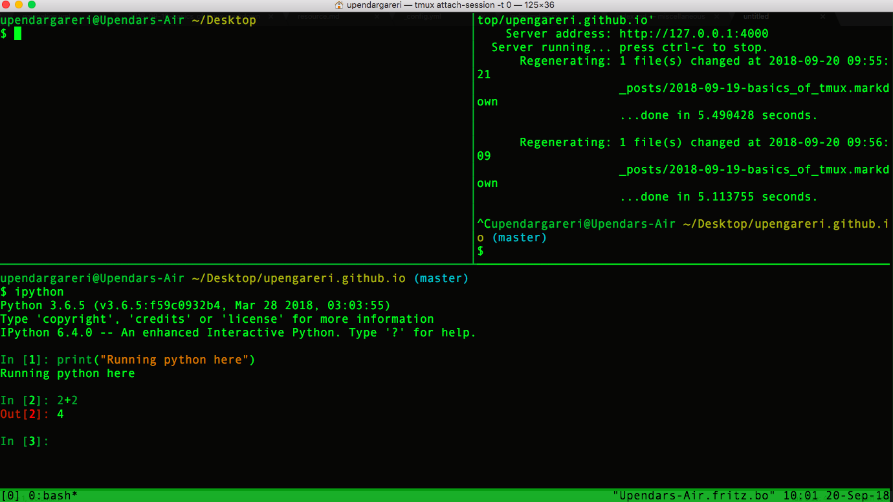

## What is tmux?
It stands for ***terminal multiplexer***. In simple terms, it can multiply a single terminal window into multiple windows.



## Benefits
1. It lets us run and keep an eye on multiple programs at once. For example, in one window we can run some python code and in another window, we can start some development server and in another, we can train some machine learning model etc.

2. Session remains alive even when the internet disconnects or when the computer sleeps.
3. Many more, trust me.

## Getting Started

#### To install on Mac:

	brew install tmux

(assuming `homebrew` is installed)

#### To verify:

	tmux -V

We start using tmux by creating a session. In one session we can create several window panes. We can create multiple sessions and several windows for every session. Here I'll give an example of creating a single session and using/creating multiple windows within the session.

#### To check if a session is running:
	tmux ls

> Since we haven't created any session, it would show
```bash
$ tmux ls
no server running on /private/tmp/tmux-501/default
```

#### To create a session:
	tmux

*Note: A green bar will appear at the terminal bottom*

Now, when you run 	`tmux ls` 	it will show 	<kbd>0: 1 windows</kbd>...

Here, 0 is the name of the session (zero indexed). To create a session with a specific name, we can use

`tmux new -s [name of session]`

I prefer index to be just fine as I create only one session most of the time.

#### To go out from a session:
	Ctrl+b  d

***Note***: Press <kbd>Ctrl b</kbd> and release and then press <kbd>d</kbd>
(here *d* means detach)

##### PREFIX
`Ctrl+b` is the default prefix of tmux and basically to type most tmux commands
* press `Ctrl` and `b` together and release 
* then type any other command

#### To attach any session from list of sessions:
	tmux attach-session -t [name of session]

#### To kill any session:
	tmux kill-session -t [name of session]

#### To kill the server and thus all the sessions:
	tmux kill-server

Now that we know how to create, detach, attach and kill session(s), let's create multiple windows within a session.
Assuming we are in a session (attached) - 

#### To create a horizontal pane:
	Ctrl+b "

#### To create a vertical pane:
	Ctrl+b %

***Note***: Press `Ctrl b` together and then release after which press `%`(have to use shift button in some keyboards to press `%`).

#### Move to another pane:
	Ctrl+b arrow_key

#### Kill current pane:
	Ctrl+b x

#### Re-sizing current pane (expanding):
	Ctrl+b :

(opens up the tmux prompt bar) and then in the tmux promt at the bottom type

	resize-pane -D 2

***Note***: Here D means down and 2 means number of lines. Similarly **U: UP, L: LEFT, R: RIGHT**. 

---

### Summary of most basic commands:
```
tmux 				-> Starts a session

Ctrl+b "			-> Creates horizontal pane

Ctrl+b %			-> Creates vertical pane

Ctrl+b arrow_keys		-> Move to a pane

tmux kill-server		-> Kill server and all panes
```


