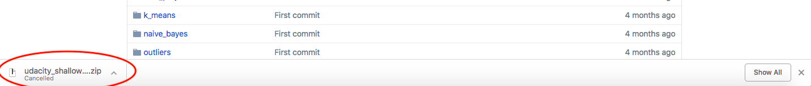

### Curlwget
---
It is a plugin to quickly download any file from internet through a console.

#### Why use it?
It maintains the session when downloading files over an unstable internet connection.

#### How to use it?
* Install the curlwget extension in Chrome.

* Start the download (the way you download normally) and then cancel it.

* Click on the curlwget yellow button and paste the whole text into your terminal.

_Note_: The file gets downloaded on your terminal path.

_Note_: Sometimes, I have found that some pages do not load quickly while browsing because of curlwget extension
        (Says, waiting for curlwget extension in the browser (bottom leftmost part)). In that case, just go to 
        manage extension in Chrome and switch off and then on the curlwget extension.
